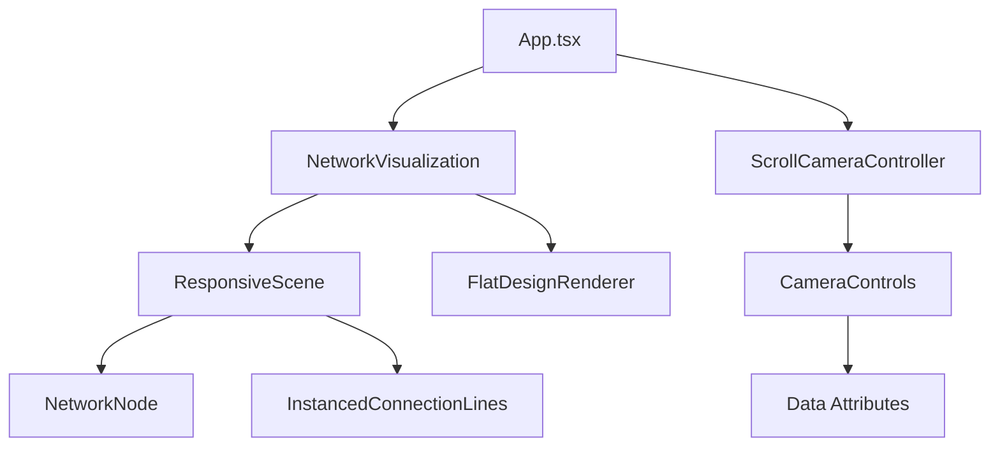

# 🌐 3D Network Visualization - Documentation

> **Version actuelle :** 2.1.0  
> **Dernière mise à jour :** Janvier 2025  
> **Technologies :** React Three Fiber, GSAP, Tailwind CSS v4

## 📋 Table des Matières

1. [Vue d'ensemble](#vue-densemble)
2. [Fonctionnalités principales](#fonctionnalités-principales)
3. [Architecture du projet](#architecture-du-projet)
4. [Composants principaux](#composants-principaux)
5. [Système de contrôle caméra](#système-de-contrôle-caméra)
6. [Modes de rendu](#modes-de-rendu)
7. [Configuration et utilisation](#configuration-et-utilisation)
8. [Guide de développement](#guide-de-développement)
9. [API et Props](#api-et-props)
10. [Performances et optimisations](#performances-et-optimisations)

---

## 🎯 Vue d'ensemble

Cette application de visualisation 3D permet d'explorer des structures de réseau complexes dans un environnement immersif. Elle combine React Three Fiber pour le rendu 3D, GSAP pour les animations fluides, et un système de contrôle caméra basé sur le scroll pour une expérience cinématographique.

### 🚀 Fonctionnalités Clés

- **Visualisation 3D interactive** avec 10 nœuds de réseau (9 bleus, 1 orange)
- **Double mode de rendu** : 3D réaliste ou flat design
- **Contrôles caméra basés sur le scroll** avec data-attributes HTML
- **Animation de rotation Y** activable/désactivable
- **Interface de contrôle en temps réel**
- **Design responsive** avec support mobile/tablette
- **Performance optimisée** avec InstancedMesh et gestion mémoire

---

## 🎛️ Fonctionnalités principales

### 🔷 Visualisation de Réseau

- **10 nœuds sphériques** avec rayons et positions variables
- **Palette de couleurs simplifiée** : bleu (#2563eb) et orange (#f97316)
- **Lignes de connexion** entre nœuds avec transparence
- **Animations élastiques** sur chaque nœud avec mouvement aléatoire
- **Éclairage physique** avec support des matériaux iridescents

### 🎥 Système de Contrôle Caméra

#### **Contrôles basés sur les data-attributes**
```html
<section 
  data-scroll-camera="true"
  data-scroll-start="top 80%"
  data-scroll-end="bottom 20%"
  data-on-enter-zoom="1.5"
  data-on-enter-position-x="5"
  data-on-enter-position-y="2"
  data-on-enter-position-z="8"
>
```

#### **Presets de caméra**
- **Default** : `[0, 0.5, 10]` - Vue générale
- **Top View** : `[5, 15, 5]` - Vue du dessus
- **Side View** : `[8, 3, 0]` - Vue de côté
- **Wide View** : `[25, 2, 25]` - Vue large

### 🎨 Modes de Rendu

#### **Mode 3D (par défaut)**
- Matériaux `MeshPhysicalMaterial` avec propriétés physiques
- Éclairage complexe avec ombres et reflets
- Brouillard pour l'effet de profondeur
- Propriétés : roughness, metalness, iridescence

#### **Mode Flat Design**
- Matériaux `MeshBasicMaterial` sans relief
- Éclairage uniforme sans ombres
- Suppression du brouillard
- Conservation des formes et couleurs

### 🔄 Animation de Rotation

- **Mouvement sinusoïdal fluide** sur l'axe Y
- **Oscillation de -45° à +45°** avec GSAP
- **Activable/désactivable** en temps réel
- **Performance optimisée** avec cleanup automatique

---

## 🏗️ Architecture du projet

```
src/
├── App.tsx                          # Point d'entrée principal
├── components/
│   ├── NetworkVisualization.tsx     # Composant 3D principal
│   ├── CameraControls.tsx          # Système de contrôle caméra
│   ├── FlatDesignRenderer.tsx      # Module rendu flat design
│   ├── ScrollCameraController.tsx   # Contrôleur scroll
│   └── ui/                         # Composants shadcn/ui
├── styles/
│   └── globals.css                 # Styles Tailwind v4
└── documentation.md                # Cette documentation
```

### 🎯 Flux de données



---

## 🧩 Composants principaux

### 📦 NetworkVisualization

**Fichier :** `/components/NetworkVisualization.tsx`

Composant principal gérant la scène 3D, les nœuds, les connexions et les animations.

**Props :**
```typescript
interface NetworkVisualizationProps {
  enableRotationAnimation?: boolean; // Animation rotation Y
  enableFlatDesign?: boolean;        // Mode flat design
}
```

**Fonctionnalités :**
- Gestion de 10 nœuds avec positions et connexions définies
- Animation GSAP pour rotation sinusoïdale
- Support dual rendering (3D/Flat)
- Responsive camera settings
- Performance optimisée avec `useMemo` et `useRef`

### 🎥 CameraControls

**Fichier :** `/components/CameraControls.tsx`

Système de contrôle caméra basé sur les data-attributes HTML.

**Data-attributes supportés :**
- `data-camera-zoom` : Niveau de zoom
- `data-camera-position-[x|y|z]` : Position caméra
- `data-camera-target-[x|y|z]` : Cible caméra
- `data-camera-rotation-[x|y|z]` : Rotation caméra

### 🎨 FlatDesignRenderer

**Fichier :** `/components/FlatDesignRenderer.tsx`

Module dédié au rendu flat design avec hooks et composants spécialisés.

**Hooks disponibles :**
- `useFlatDesignMaterial` : Création matériaux adaptatifs
- `useFlatDesignLighting` : Configuration éclairage
- `useFlatDesignToggle` : Utilitaire toggle

### 📜 ScrollCameraController

**Fichier :** `/components/ScrollCameraController.tsx`

Contrôleur scroll utilisant GSAP ScrollTrigger pour animations basées sur le défilement.

**Configuration :**
```typescript
<ScrollCameraController 
  selector="[data-scroll-camera]"
  enabled={true}
  debug={true}
/>
```

---

## 🎮 Système de contrôle caméra

### 📊 Data-attributes de base

| Attribut | Description | Exemple |
|----------|-------------|---------|
| `data-scroll-camera` | Active le contrôle scroll | `"true"` |
| `data-scroll-start` | Point de déclenchement début | `"top 80%"` |
| `data-scroll-end` | Point de déclenchement fin | `"bottom 20%"` |
| `data-scroll-markers` | Affichage markers debug | `"false"` |

### 🎯 Contrôles d'entrée (on-enter)

| Attribut | Description | Valeur type |
|----------|-------------|-------------|
| `data-on-enter-zoom` | Zoom à l'entrée | `1.5` |
| `data-on-enter-position-x` | Position X | `5` |
| `data-on-enter-position-y` | Position Y | `2` |
| `data-on-enter-position-z` | Position Z | `8` |
| `data-on-enter-target-x` | Cible X | `0` |
| `data-on-enter-target-y` | Cible Y | `0` |
| `data-on-enter-target-z` | Cible Z | `0` |

### 🚪 Contrôles de sortie (on-leave)

| Attribut | Description | Valeur type |
|----------|-------------|-------------|
| `data-on-leave-zoom` | Zoom à la sortie | `1` |
| `data-on-leave-position-x` | Position X sortie | `0` |
| `data-on-leave-position-y` | Position Y sortie | `0.5` |
| `data-on-leave-position-z` | Position Z sortie | `10` |

### 🔄 Contrôles d'entrée de retour (on-enter-back)

Les contrôles de retour permettent de définir des animations différentes lors du scroll vers le haut (retour en arrière).

| Attribut | Description | Valeur type |
|----------|-------------|-------------|
| `data-on-enter-back-zoom` | Zoom au retour d'entrée | `1.2` |
| `data-on-enter-back-position-x` | Position X retour entrée | `3` |
| `data-on-enter-back-position-y` | Position Y retour entrée | `1` |
| `data-on-enter-back-position-z` | Position Z retour entrée | `6` |
| `data-on-enter-back-target-x` | Cible X retour entrée | `0` |
| `data-on-enter-back-target-y` | Cible Y retour entrée | `0` |
| `data-on-enter-back-target-z` | Cible Z retour entrée | `0` |

### 🔙 Contrôles de sortie de retour (on-leave-back)

| Attribut | Description | Valeur type |
|----------|-------------|-------------|
| `data-on-leave-back-zoom` | Zoom à la sortie de retour | `0.8` |
| `data-on-leave-back-position-x` | Position X sortie retour | `12` |
| `data-on-leave-back-position-y` | Position Y sortie retour | `4` |
| `data-on-leave-back-position-z` | Position Z sortie retour | `12` |
| `data-on-leave-back-target-x` | Cible X sortie retour | `0` |
| `data-on-leave-back-target-y` | Cible Y sortie retour | `0` |
| `data-on-leave-back-target-z` | Cible Z sortie retour | `0` |

#### 📋 Fonctionnement des contrôles de retour

Les contrôles de retour (`on-enter-back` et `on-leave-back`) offrent une expérience utilisateur plus raffinée en permettant des animations différentes selon la direction du scroll :

**🔽 Scroll vers le bas (normal) :**
- `on-enter` : Animation d'entrée dans la section
- `on-leave` : Animation de sortie de la section

**🔼 Scroll vers le haut (retour) :**
- `on-enter-back` : Animation d'entrée en revenant dans la section
- `on-leave-back` : Animation de sortie en remontant de la section

#### 💡 Cas d'utilisation des contrôles de retour

**🎬 Cinématographie avancée :**
```html
<section 
  data-scroll-camera="true"
  data-scroll-start="top 80%"
  data-scroll-end="bottom 20%"
  
  <!-- Animations descendantes -->
  data-on-enter-zoom="2"
  data-on-enter-position-x="10"
  data-on-enter-position-y="5"
  data-on-enter-position-z="5"
  
  data-on-leave-zoom="1.5"
  data-on-leave-position-x="5"
  data-on-leave-position-y="2"
  data-on-leave-position-z="8"
  
  <!-- Animations de retour (montantes) -->
  data-on-enter-back-zoom="1.8"
  data-on-enter-back-position-x="8"
  data-on-enter-back-position-y="3"
  data-on-enter-back-position-z="6"
  
  data-on-leave-back-zoom="1"
  data-on-leave-back-position-x="0"
  data-on-leave-back-position-y="0.5"
  data-on-leave-back-position-z="10"
>
  <!-- Contenu de la section -->
</section>
```

**🎯 Avantages des contrôles de retour :**

- **Fluidité narrative** : Créer des transitions différentes selon la direction de navigation
- **Expérience asymétrique** : Offrir des perspectives variées lors du retour
- **Optimisation UX** : Adapter l'animation à l'intention utilisateur
- **Storytelling avancé** : Raconter une histoire différente en sens inverse

### 💡 Exemple d'utilisation complète avec retours

```html
<section 
  id="dynamic-section"
  data-scroll-camera="true"
  data-scroll-start="top 80%"
  data-scroll-end="bottom 20%"
  data-scroll-markers="false"
  
  <!-- Entrée normale (scroll vers le bas) -->
  data-on-enter-zoom="1.5"
  data-on-enter-position-x="5"
  data-on-enter-position-y="2"
  data-on-enter-position-z="8"
  data-on-enter-target-x="0"
  data-on-enter-target-y="0"
  data-on-enter-target-z="0"
  
  <!-- Sortie normale (scroll vers le bas) -->
  data-on-leave-zoom="1"
  data-on-leave-position-x="0"
  data-on-leave-position-y="0.5"
  data-on-leave-position-z="10"
  
  <!-- Entrée de retour (scroll vers le haut) -->
  data-on-enter-back-zoom="1.8"
  data-on-enter-back-position-x="8"
  data-on-enter-back-position-y="4"
  data-on-enter-back-position-z="6"
  data-on-enter-back-target-x="0"
  data-on-enter-back-target-y="0"
  data-on-enter-back-target-z="0"
  
  <!-- Sortie de retour (scroll vers le haut) -->
  data-on-leave-back-zoom="2.2"
  data-on-leave-back-position-x="12"
  data-on-leave-back-position-y="6"
  data-on-leave-back-position-z="3"
>
  <!-- Contenu de la section -->
</section>
```

---

## 🎨 Modes de rendu

### 🔮 Mode 3D (Défaut)

**Caractéristiques :**
- `MeshPhysicalMaterial` avec propriétés physiques réalistes
- Éclairage complexe : ambient, directional, point lights
- Fog pour effet de profondeur
- Propriétés matériaux :
  - `roughness: 0.85`
  - `metalness: 0.42`
  - `iridescence: 0.5`
  - `ior: 1.4`

**Code activation :**
```tsx
<NetworkVisualization enableFlatDesign={false} />
```

### 📐 Mode Flat Design

**Caractéristiques :**
- `MeshBasicMaterial` sans propriétés physiques
- Éclairage uniforme (ambient light uniquement)
- Pas de fog ni d'effets de profondeur
- Conservation des formes géométriques et couleurs
- Transparence préservée

**Code activation :**
```tsx
<NetworkVisualization enableFlatDesign={true} />
```

### 🔄 Basculement dynamique

```typescript
const [enableFlatDesign, setEnableFlatDesign] = useState(false);

const toggleFlatDesign = () => {
  setEnableFlatDesign(prev => !prev);
};
```

---

## ⚙️ Configuration et utilisation

### 🚀 Installation

```bash
npm install
npm run dev
```

### 🎛️ Props NetworkVisualization

```typescript
interface NetworkVisualizationProps {
  enableRotationAnimation?: boolean;  // Défaut: true
  enableFlatDesign?: boolean;         // Défaut: false
}
```

### 🎯 Configuration réseau

Les nœuds du réseau sont définis dans `generateNetworkNodes()` :

```typescript
const nodes: Node[] = [
  {
    id: 0,
    position: [-3, 1, -1.5],
    radius: 0.6,
    color: "#2563eb",      // Bleu
    connections: [1, 3, 4, 8],
  },
  {
    id: 5,
    position: [1, 0.75, 0.5],
    radius: 0.5,
    color: "#f97316",      // Orange (nœud clé)
    connections: [4, 6, 8],
  },
  // ... autres nœuds
];
```

### 🎨 Customisation couleurs

Dans `/styles/globals.css`, les couleurs sont définies via CSS variables :

```css
:root {
  --primary: #030213;
  --secondary: oklch(0.95 0.0058 264.53);
  --accent: #e9ebef;
  /* ... autres variables */
}
```

---

## 🛠️ Guide de développement

### 📝 Ajout d'un nouveau nœud

1. **Modifier `generateNetworkNodes()`** dans `NetworkVisualization.tsx`
2. **Définir position, rayon, couleur, connexions**
3. **Mettre à jour les connexions des nœuds existants si nécessaire**

```typescript
{
  id: 10,
  position: [2, -1, 0.5],
  radius: 0.4,
  color: "#2563eb",
  connections: [5, 8],
}
```

### 🎥 Ajout contrôle caméra personnalisé

1. **Ajouter data-attributes** à l'élément HTML
2. **Configurer les triggers ScrollTrigger**
3. **Définir les paramètres caméra**

```html
<div 
  data-scroll-camera="true"
  data-scroll-start="top bottom"
  data-on-enter-zoom="2"
  data-on-enter-position-x="10"
>
```

### 🎨 Modification rendu

1. **Étendre `FlatDesignConfig`** pour nouvelles options
2. **Modifier `createToonMaterial()`** pour nouveaux matériaux
3. **Mettre à jour `FlatDesignLights`** pour éclairage personnalisé

### 🔄 Nouvelle animation

1. **Créer timeline GSAP** dans `useEffect`
2. **Utiliser `useFrame`** pour application temps réel
3. **Ajouter cleanup** dans le return de `useEffect`

---

## 📡 API et Props

### 🧩 NetworkVisualization

```typescript
interface NetworkVisualizationProps {
  enableRotationAnimation?: boolean;
  enableFlatDesign?: boolean;
}

// Utilisation
<NetworkVisualization 
  enableRotationAnimation={true}
  enableFlatDesign={false}
/>
```

### 🎥 ScrollCameraController

```typescript
interface ScrollCameraControllerProps {
  selector: string;
  enabled: boolean;
  debug?: boolean;
}

// Utilisation
<ScrollCameraController 
  selector="[data-scroll-camera]"
  enabled={true}
  debug={true}
/>
```

### 🎨 FlatDesignConfig

```typescript
interface FlatDesignConfig {
  enableFlatDesign: boolean;
  preserveTransparency: boolean;
  flatAmbientIntensity: number;
  removeFog: boolean;
}
```

### 🎯 Node Interface

```typescript
interface Node {
  id: number;
  position: [number, number, number];
  radius: number;
  color: string;
  connections: number[];
}
```

---

## ⚡ Performances et optimisations

### 🚀 Optimisations actuelles

#### **Rendu optimisé**
- `InstancedMesh` pour les lignes de connexion
- `useMemo` pour éviter recalculs des nœuds
- `useRef` pour objets réutilisables (évite GC)
- Cleanup automatique des matériaux

#### **Gestion mémoire**
- Singleton gradient texture partagée
- Disposal automatique des matériaux
- Timeline GSAP cleanup
- SharedResources cleanup

#### **Performance 3D**
- Canvas `dpr={[1, 2]}` adaptatif
- `performance={{ min: 0.5 }}`
- `antialias: true` avec `powerPreference: "high-performance"`

### 📊 Métriques recommandées

- **FPS cible :** 60 fps sur desktop, 30 fps sur mobile
- **Memory usage :** <100MB pour la visualisation
- **Load time :** <2s pour initialisation complète

### 🔧 Debug et monitoring

#### **Console logs**
- `🎛️` État des props NetworkVisualization
- `🎬` Changements contrôles caméra
- `🔄` Toggle animations
- `🎨` Mode rendu actuel

#### **Debug panel**
Interface de debug intégrée affichant :
- Position caméra actuelle
- État des animations
- Mode de rendu actif
- Données data-attributes

---

## 📱 Support et responsive

### 🖥️ Desktop (>1024px)
- Position caméra : `[0, 0.5, 10]`
- FOV : 50°
- Contrôles complets

### 📱 Tablet (768-1024px)
- Position caméra : `[12, 0.8, 12]`
- FOV : 55°
- Interface adaptée

### 📱 Mobile (<768px)
- Position caméra : `[15, 1, 15]`
- FOV : 65°
- Contrôles simplifiés

---

## 🔮 Évolutions futures

### 🎯 Roadmap

- [ ] **Mode VR/AR** avec WebXR
- [ ] **Données dynamiques** via API
- [ ] **Thèmes personnalisés** pour couleurs
- [ ] **Export** images/vidéos
- [ ] **Mode collaborative** multi-utilisateur
- [ ] **Analytics** interactions utilisateur
- [ ] **Accessibilité** améliorée (ARIA, keyboard nav)

### 🛠️ Améliorations techniques

- [ ] **Streaming** pour gros datasets
- [ ] **Web Workers** pour calculs lourds
- [ ] **Bundle splitting** optimisé
- [ ] **PWA** support offline
- [ ] **Tests** automatisés (Jest + React Testing Library)

---

## 📞 Support et contribution

### 🐛 Signalement de bugs

1. Vérifier les logs console
2. Reproduire avec steps précis
3. Inclure configuration browser/device
4. Fournir screenshots si nécessaire

### 🤝 Contribution

1. Fork du repository
2. Branche feature : `git checkout -b feature/nouvelle-fonctionnalite`
3. Commit : `git commit -m "Ajout nouvelle fonctionnalité"`
4. Push : `git push origin feature/nouvelle-fonctionnalite`
5. Pull Request avec description détaillée

---

## 📄 Licences et crédits

### 🛠️ Technologies utilisées

- **React Three Fiber** - Rendu 3D
- **GSAP** - Animations
- **Three.js** - Engine 3D
- **Tailwind CSS v4** - Styling
- **TypeScript** - Type safety

### 🙏 Remerciements

- Community React Three Fiber
- GSAP Team pour ScrollTrigger
- Tailwind Labs pour v4 beta

---

**📅 Dernière mise à jour :** Janvier 2025  
**👨‍💻 Développé avec ❤️ pour la visualisation de données 3D**